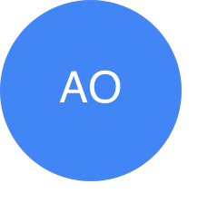

# vue-initials-placeholder

 [](https://opensource.org/licenses/MIT) 

> A vue component that uses parsed initials as placeholders. Can be used as a substitute for absent user profile photo.



## Installation
```bash
# yarn
yarn add vue-initials-placeholder

# npm
npm i --save vue-initials-placeholder
```

## Usage

#### See [Demo](https://codesandbox.io/s/vue-initials-placeholder-t9bqk)

```js
<template>
  <div>
    <VueInitialsPlaceholder value="Emmanuel Raymond"/>
  </div>
</template>

<script>
import VueInitialsPlaceholder from 'vue-initials-placeholder'

export default {
  components: {
    VueInitialsPlaceholder
  }
}
</script>
```
### Props

|Name|Type|Default|Description|Required
|---|---|---|---|---|
|value|String|null|The name you want to parse as placeholder   | true 
|bgColor|String|#4285F4|Background color - [color name, rgb or hex] | false
|size|String|40|The width and height of the container that contains the initials in px| false
|textColor|String|#fff|Text color of the initials - [color name, rgb or hex]| false
|fontSize|String|18|Font size of the initials in px|false

## Acknowledgement

This package was inspired by [Initials-placeholder-react](https://github.com/ozorku/Initials-placeholder-react)

## Contributing
If you would like to report bugs or request a feature, please create a new [issue](https://github.com/peoray/vue-initials-placeholder/issues/new).
 
If you'd like to contribute to the code:

- Fork it!
- Create your feature branch: `git checkout -b feature-name`
- Commit your changes: `git commit -am 'Some commit message'`
- Push to the branch: `git push origin feature-name`
- Submit a pull request!

## License
This project is released under the terms of the [MIT](LICENSE) License


